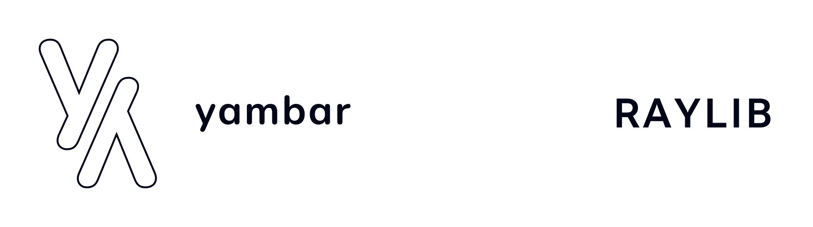
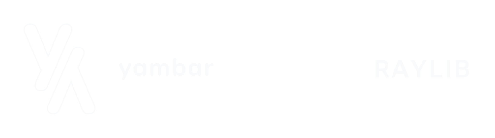

  
  

# yambar::raylib

The open-source bindings for the [`raylib`](https://raylib.com/) library for writing games for the [.NET](https://dotnet.microsoft.com/) platform.

## Requirements

- A desktop platform with the [.NET 8.0 SDK](https://dotnet.microsoft.com/download) installed.
- When working with the codebase, we recommend using an IDE with intellisense and syntax highlighting such as [Visual Studio 2022+](https://visualstudio.microsoft.com/vs/), [JetBrains Rider](https://www.jetbrains.com/rider/), or [Visual Studio Code](https://code.visualstudio.com/) with [EditorConfig](https://marketplace.visualstudio.com/items?itemName=EditorConfig.EditorConfig) and [C#](https://marketplace.visualstudio.com/items?itemName=ms-dotnettools.csharp) plugin installed.

## License

[**yambar::raylib**](https://github.com/yambar/raylib)'s code are licensed under the [MIT License](https://opensource.org/licenses/MIT). Please see the [the license file](../COPYING) for more information. [tl;dr](https://tldrlegal.com/license/mit-license), you're free to do whatever you want as long as you include the original copyright and license notice on any copy of the software/source.
